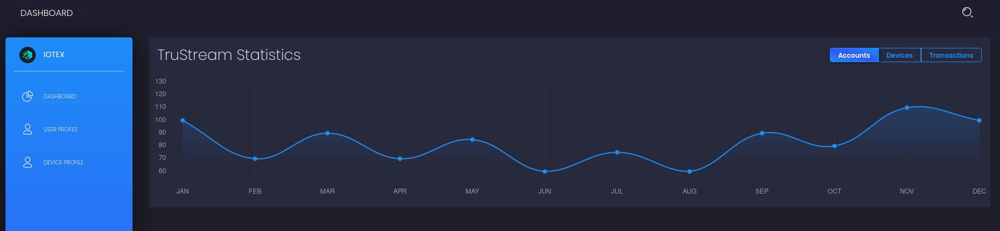
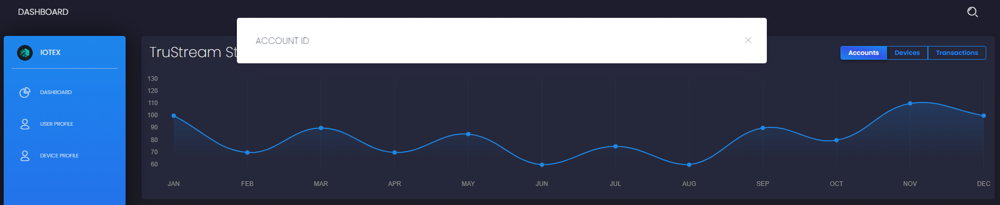
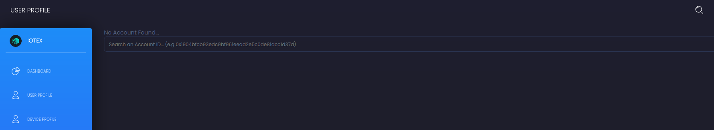
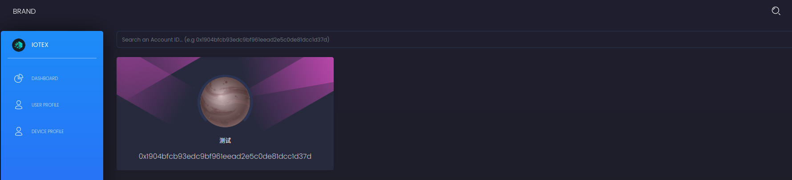
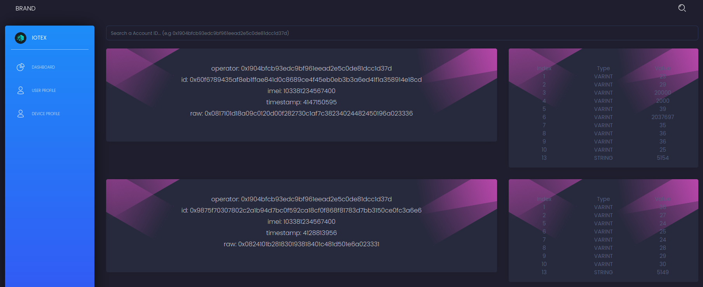

# IoTeX-Dashboard

Just a simple dashboard done for a [Hackathon](https://gitcoin.co/issue/iotexproject/halogrants/52/100026522)

## Screenshots
Main Screen
  
Search Bar
  
User Profile
  
Device Profile
  
Decoding of Protobuf
  

## Problems
- ~~Doesn't work correctly on vercel due to IoTeX's graph node not supporting SSL correctly.~~ Re-Deployed on Heroku..  
- If you see `Error: Objects are not valid as a React child (found: Error: Network request failed). If you meant to render a collection of children, use an array instead.`, change https to http.

## Diary
I had fun churning this project out. It was a nice experience to work with React yet again.

## Probable Improvements
Have proper statictics of the Accounts, Devices and Transactions on the front Page.
